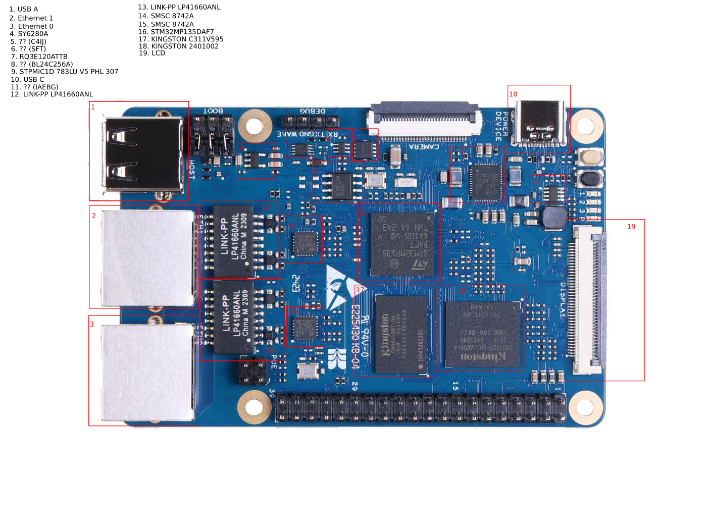
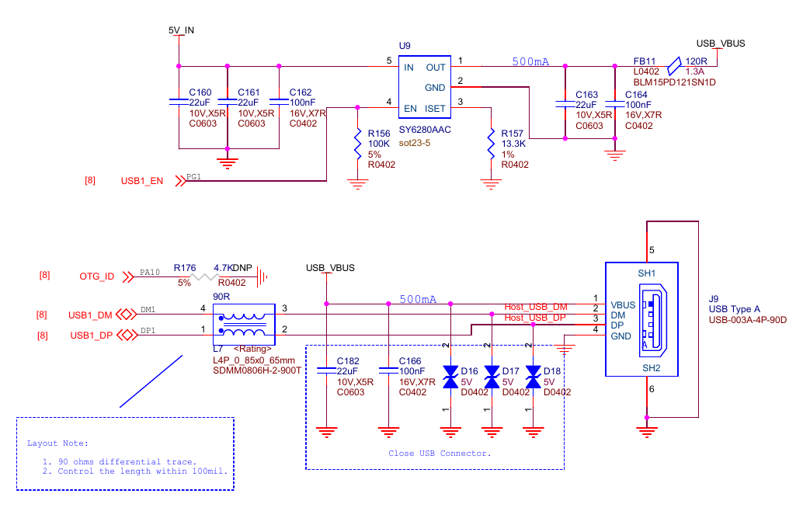
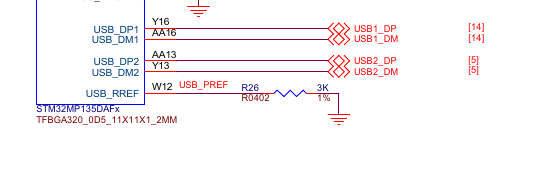
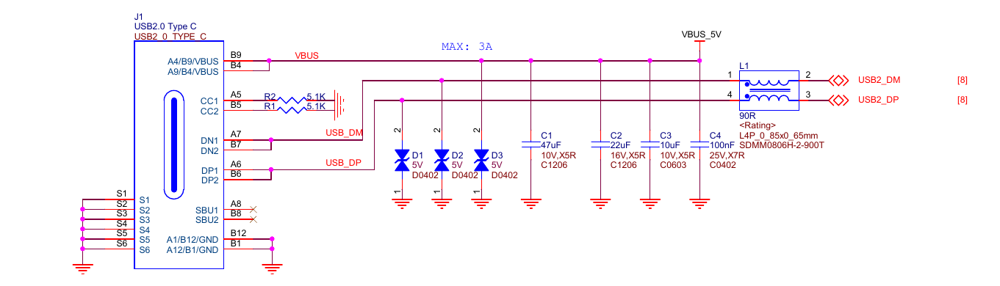
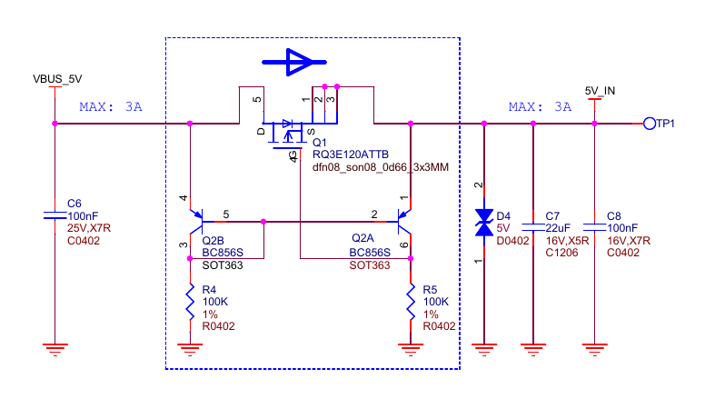
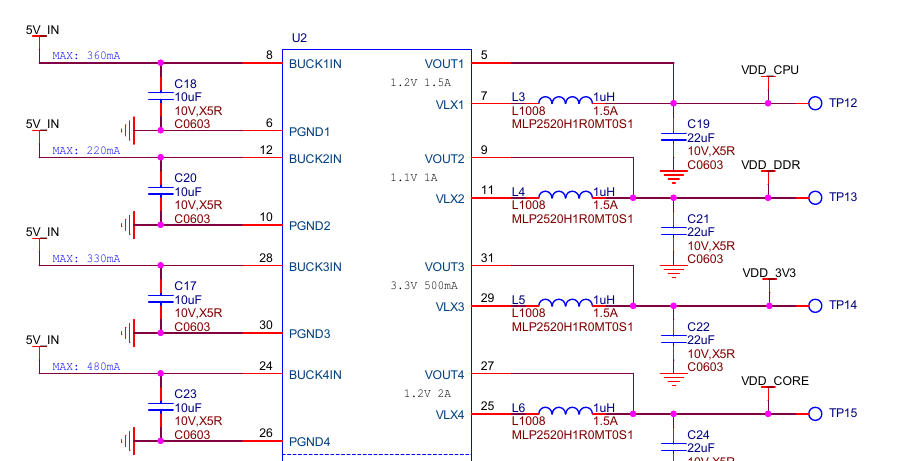

Hardware
===========

USB A
------

USB A connector has 4 wires VBUS (power), DM (data), DP (data) and GND (ground).

VBUS is connected to a switch marked on the photo with number 4. Switch is controlled
by CPU's GPIOG pin 1, meaning that USB A port can be powered on and off by the CPU.
Switch model is SY6280AAC which datasheet is available [here](path:./assets/SY6280.pdf).

DM and DP are connected to USBH port 1. While CPU's OTG wire is shortcuted to GND meaning USB A
cannot negotiate USB role dynamically.

USB C
------

USB C connector has 5 wires  VBUS (power), DM (data), DP (data), CC (channel control) and GND (ground). 
Standard USB C has more wires but the USB controller in the CPU uses USB 2.0 which make use of only 5 of them.

VBUS serves as input to a transistor, the transistor act as a switch and a diod simultanously. 
It's role in the system is protecting power supply from backffeeding from other power sources like GPIO power line. 

The output of the transistor is connected to PMIC, which further convert it into multiple power sources adequate for CPU.  

Power pipeline looks sth like this: USB C -> Switch -> PMIC -> CPU.  
USB C outputs 5V, as well as switch, PMIC converts 5V to various voltages according to CPU needs.

Switch model is RQ3E120ATTB which datasheet is available [here](path:./assets/RQ3E120ATTB.pdf).

DM and DP are connected to USBH port 2. CC ports are bring down via pull down resistors, meaning the USB C
role is always a peripheral. Similiarly to USB A this port cannot negotiate USB role dynamically.

