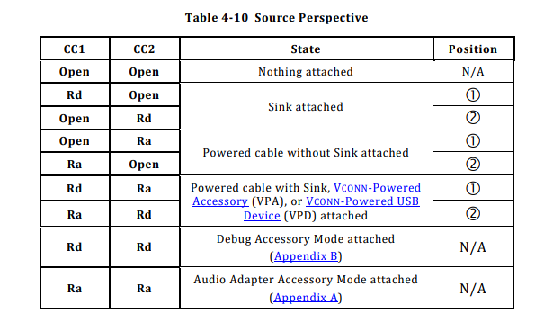
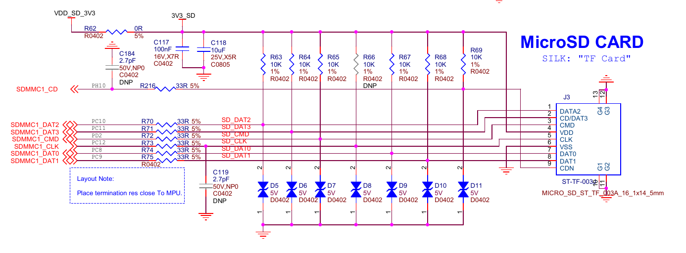
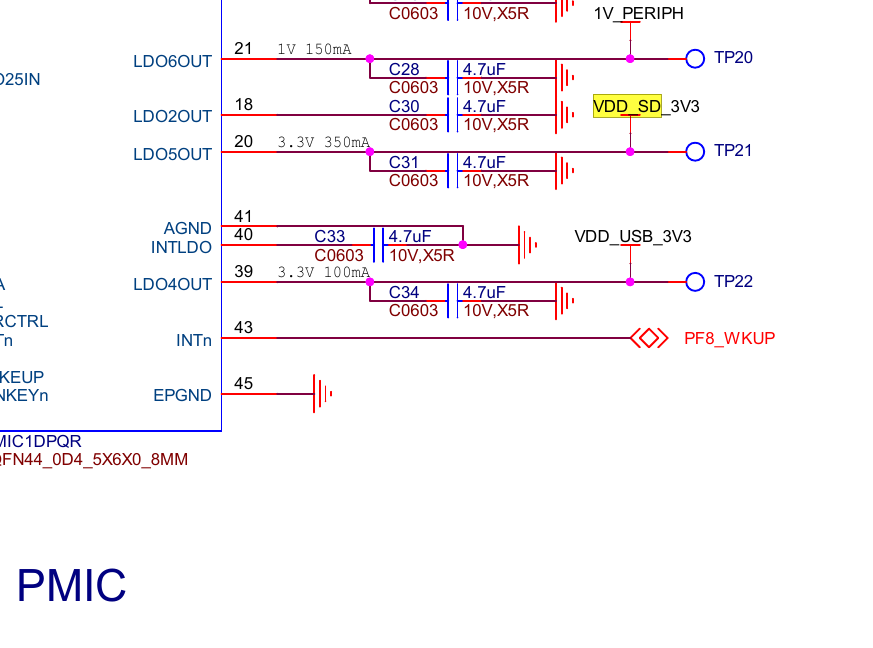
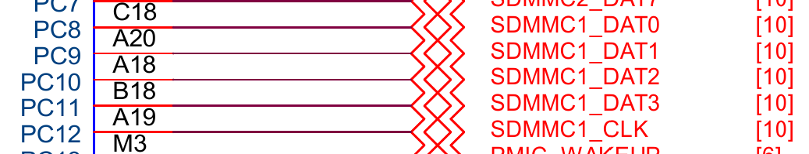
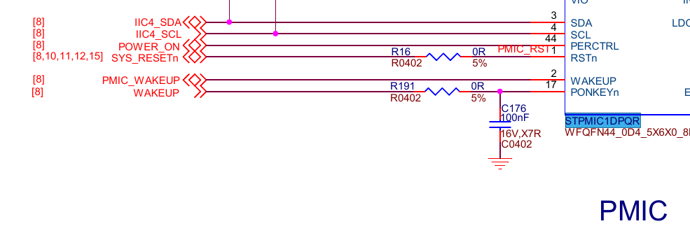
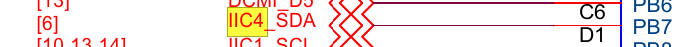
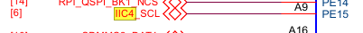
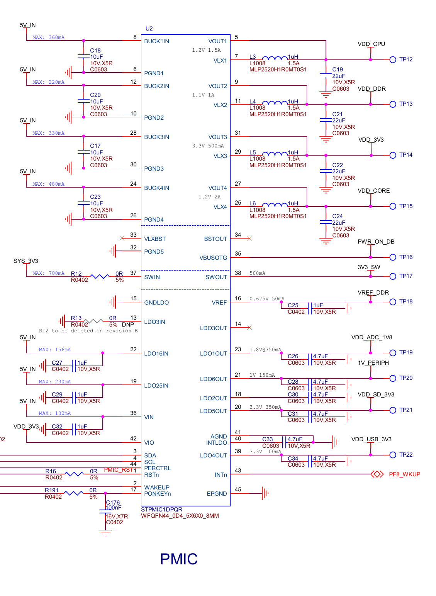
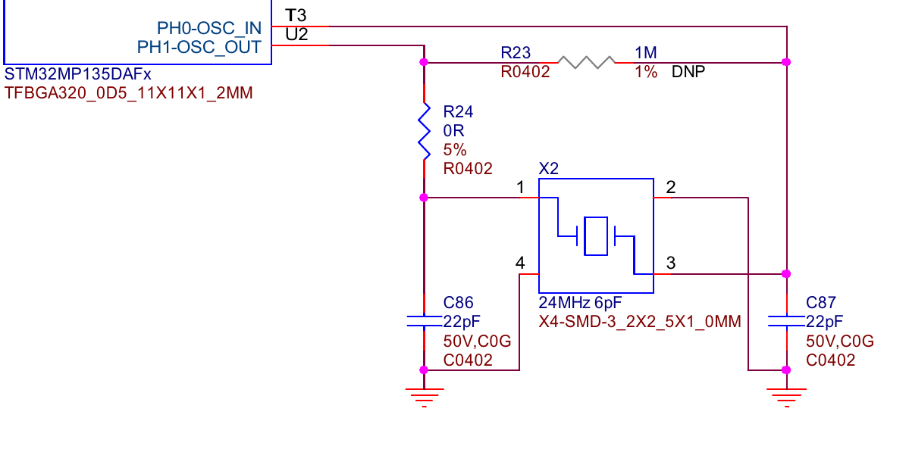

Hardware
===========


USB A
------

USB A connector has 4 wires VBUS (power), DM (data), DP (data) and GND (ground).

Let's first talk about power pin, the power is routed via a switch which allow switching
power to USB A on and off. The switch is on the photo with number 4. For controlling the
switch responsible is CPU using GPIOG pin 1. Switch model is SY6280AAC which datasheet 
is available [here](path:./assets/SY6280.pdf).

DM and DP lines are connected to USBH port 1.

Theoretically our CPU exposes OTG roles cabability on port 1, but in practice OTG ID pin
is always 0 because of hardwired pull-down resistor. 

```{csv-table} USB A pinnout
:header: >
:    "Func", "Ball", "Chip Pin"
:widths: 15, 10, 20

"USB1_EN", "R1", "GPIOG pin 1"
"OTG_ID", "AA19", "GPIOA pin 10"
"USB1_DM", "AA16", "USBH port 1 DM"
"USB1_DP", "Y16", "USBH port 1 DP"
```


USB C
------

USB C connector has 10 wires  VBUSx2 (power), DMx2 (data), DPx2 (data), CCx2 (channel control) and GNDx2 (ground). 
Standard USB C has more wires but the USB controller in the CPU uses USB 2.0 which make use of only 10 of them.

From CC pins we can see that when we plug the USB C cable in it will make use of only one CC pin and this pin will
be bring down. On the diagram you can see both CC pins bring low so one could argue that host will actually see two 
pins bring low. But we need to remember that real male connector make use of only one of them at the time. 
So host will se R1 or R2 voltage on one CC pin and open circuit on the other. One CC open and one CC closed
is interpreted as USB peripheral device (sink means power receiver, peripheral receives power, host provide it).



The power is provided via a transistor which serves mainly as diode protecting power source from backfeeding.
It is possible because control pin of the transistor is wired in a way that only when power is supplied to transistor
input, the difference in voltage is positive and allow for current going threw transistor. If power is applied the
other way around negative voltage prevents transistor from opening, hence the diode functionality. Transistor model
is RQ3E120ATTB which datasheet is available [here](path:./assets/RQ3E120ATTB.pdf).

USB C outputs 5V, which goes as transistor input, the output of the transistor is connected to PMIC. PMIC receives 5V
which it further convert it into multiple different voltages adequate for other subsystems on the board. 

Power pipeline looks sth like this: USB C -> Switch -> PMIC -> CPU.

DM and DP are connected to USBH port 2.

```{csv-table} USB C pinnout
:header: >
:    "Func", "Ball", "Chip Pin"
:widths: 15, 10, 20

"USB_DM", "Y13", "USBH port 2 DM"
"USB_DP", "AA13", "USBH port 2 DP"
```


Micro SD card
----------------

SD Card slot has 9 wires VDD (power), VSS (ground), CLK (clock), CMD (command), DAT0 (data), DAT1, DAT2, DAT3 and CD (card detection).

According to SD specification SD card itself has embedded microcontroller, so purpose of the slot is to provide physical wiring so the MCU
inside an SD card can talk to SDMMC chip inside the CPU. SD card slot model is ST-TF-003A which datasheet is available [here](path:./assets/ST-TF-003A.pdf).

Power pin is connected to one of PMIC outputs. The SD card slot support 4 bit SD bus mode, so we have 4 data wires between the slot and the CPU.

The SD card slot is missing from the picture because it is on the other side of the board.

```{csv-table} Micro SD Card pinnout
:header: >
:    "Func", "Ball", "Chip Pin", "Description"
:widths: 20, 10, 20, 30

"SDMMC1_DAT0", "C18", "GPIOC pin 8", "Data 0"
"SDMMC1_DAT1", "A20", "GPIOC pin 9", "Data 1"
"SDMMC1_DAT2", "A18", "GPIOC pin 10", "Data 2"
"SDMMC1_DAT3", "B18", "GPIOC pin 11", "Data 3"
"SDMMC1_CLK", "A19", "GPIOC pin 12", "Clock"
"SDMMC1_CMD", "C19", "GPIOD pin 2", "Command or Response"
"SDMMC1_CD", "E14", "GPIOH pin 10", "Card detection"
```








PMIC
-----

PMIC (STPMIC1DPQR) has a lot of wires so, let's split them in two groups: power control and power supply.  
PMIC model is STPMIC1DPQR which datasheet is available [here](path:./assets/stpmic1.pdf).

Power control allow us configuring board voltages while the system is already running. PMIC has it's own non volataile
memory, meaning the setings are persitent across reboots. Among the wires we have IIC4_SDA (i2c SDA), IIC4_SCL (i2c clock), 
POWER_ON (power control mode), SYS_RESET (power reset switch), PMIC_WAKEUP (power switch for host processor), WAKEUP (power 
switch for user) which is connected to wakup pin on debug connector, you can power on the board shorting wakeup and GND,
PF8_WAKEUP (interrupt from PMIC to CPU).

```{csv-table} PMIC pinnout
:header: >
:    "Func", "Ball", "Chip Pin", "Description"
:widths: 20, 10, 25, 35

"IIC4_SDA", "C6", "GPIOB pin 7", "I2C4 data"
"IIC4_SCL", "A9", "GPIOE pin 15", "I2C4 clock"
"POWER_ON", "U17", "", "Power control mode"
"SYS_RESET", "Y11", "", "Power reset input"
"PMIC_WAKEUP", "M3", "GPIOC pin 13", "Power ON from CPU"
"WAKEUP", "", "", "Power ON from User, this PIN is exposed on DEBUG connector as Wakeup"
"PF8_WKUP", "F1", "", "PMIC interrupt to CPU"
```








Power supply are pins used for providing appropriate voltages for our board. Each pin can be configured to different voltage, allowing to combine components operating at different voltage levels. Among the rails we have core supplies, peripheral supplies, reference voltages, and switched outputs, each tailored for specific subsystems such as CPU, DDR memory, ADC, USB, and external interfaces.

```{csv-table} PMIC voltages
:header: >
:    "Rail", "Source", "Voltage", "Max Current"
:widths: 25, 25, 20, 20

"VDD_CPU", "buck 1 out", "1.2V", "1.5A"
"VDD_DDR", "buck 2 out", "1.1V", "1A"
"VDD_3V3", "buck 3 out", "3.3V", "0.5A"
"VDD_CORE", "buck 4 out", "1.2V", "2A"
"3V3_SW", "sw out", "3.3V", "0.5A"
"VREF_DDR", "vref", "0.675V", "0.05A"
"VDC_ADC_1V8", "ldo 1 out", "1.8V", "0.35A"
"VDD_USB_3V3", "ldo 4 out", "3.3V", "0.1A"
"VDD_SD_3V3", "ldo 5 out", "3.3V", "0.35A"
"1V_PERIPH", "ldo 6 out", "1V", "0.15A"
```




HSE 24Mhz Crystal
--------------------

By default CPU has 3 internal clocks HSI (high speed internal) 64Mhz, CSI (low power internal) 4Mhz and LSI (low speed internal) 32kHz and support additionally 2 external HSE (high speed external) clocks.

To route clock to CPU, it need to go threw PLL1 (Phase-Locked Loops) circuit, which allow increasing frequency before it arrive at the processor. We could route HSI threw PLL1 to CPU but because of relatively lower accuracy HSE is much better suited for the job.

We can find on the schematics reference to 24Mhz crystal connected to GPIOH pin 0 and GPIOH pin 1. HSE provide only 24Mhz but because of much better accuracy than HSI, we can clock HSE up via PLL1 effectively up to ~1Ghz. Additionally we also clock RAM via HSE, to achieve maximum DDR3 frequency (533Mhz). 24Mhz clock is marked on the board's picture by number 20.

```{csv-table} HSE 24Mhz pinnout
:header: >
:    "Func", "Ball", "Chip Pin", "Description"
:widths: 20, 10, 20, 30

"OSC_IN", "T3", "GPIOH pin 0", "Oscilator in"
"OSC_OUT", "U2", "GPIOH pin 1", "Oscilator out"
```


